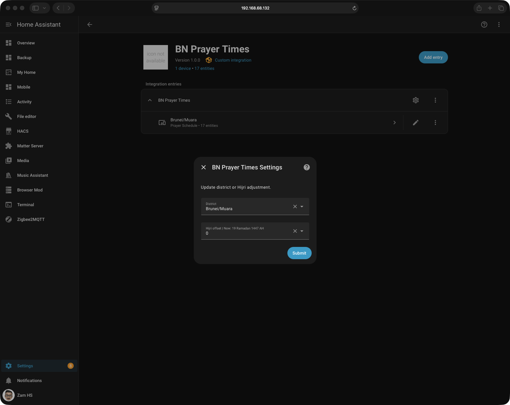
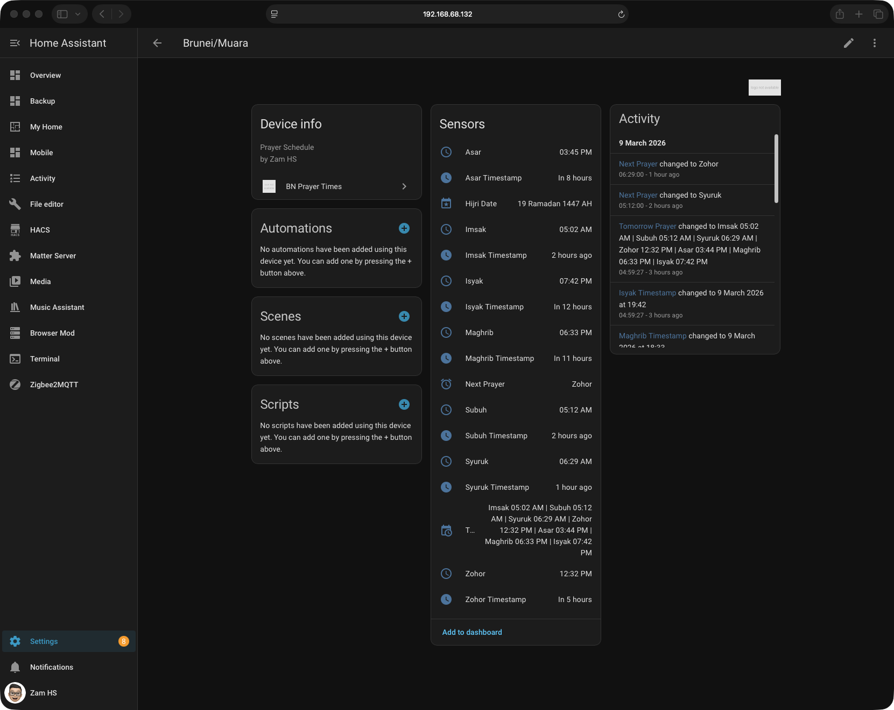
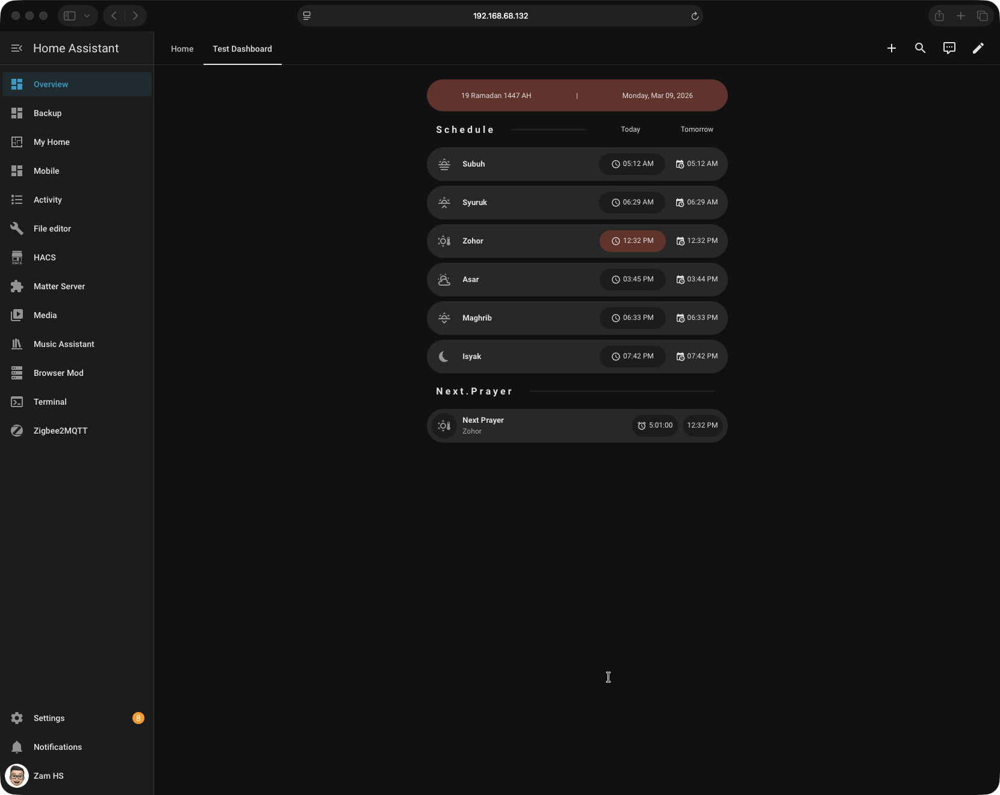

# BN Prayer Times (Brunei)

Home Assistant custom integration providing Brunei Darussalam prayer times from a local prayer schedule. This integration is designed for dashboards, and automations, featuring live countdowns, Hijri date support, and district adjustments.

## Features

- Prayer times from local prayer schedule
- Prayer timestamp for automation
- District offsets
- Hijri date (changes at Maghrib)
- Next prayer live countdown
- Tomorrow prayer schedule
- Config UI (choose district and Hijri adjustment)

## Installation (HACS)

1. Open HACS
2. Integrations → ⋮ → Custom repositories
3. Add:
   ```url
   https://github.com/zam-hs/bn-prayer-times
   ```
5. Category: Integration
6. Install
7. Restart Home Assistant
8. Add Integration → BN Prayer Times

## Supported Districts

- Brunei/Muara
- Tutong (+1 min)
- Kuala Belait (+3 mins)
- Temburong

## Automations Example

Notify before Maghrib

```yaml
description: ""
mode: single
triggers:
  - trigger: time
    at: sensor.maghrib_timestamp
    weekday:
      - mon
      - tue
      - wed
      - thu
      - fri
      - sat
      - sun
conditions: []
actions:
  - action: notify.mobile_app_zams_iphone
    metadata: {}
    data:
      message: Maghrib prayer time
```
Note: For more advanced automation, you can play the azan through a smart speaker like the Apple HomePod.

## Screenshots





## Credits

Local prayer schedule taken from:
```url
https://www.information.gov.bn/Shared%20Documents/Kalendar%20Jabatan%20Penerangan%202026.pdf
```
